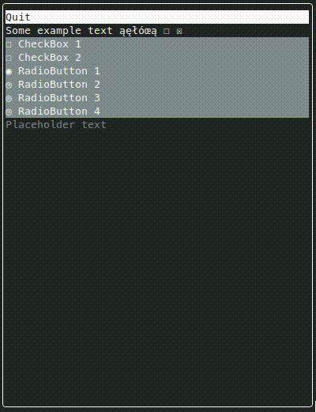

# Terminal GUI

***This project is still pre-alpha***

Widgets for your terminal, powered by Qt! Create textual GUI (TUI) in your
console easily.

## Features

* a multitude of widgets (Label, LineEdit, Button, CheckBox, RadioButton,
ListView, ...)
* layouts (fill, row, column, grid, ...)
* fully dynamic widget properties, with support for signals and slots,
animations, and other meta-object hight-level control
* custom styling support
* mouse support
* convenient and intuitive API
* support for Linux and Windows
* backed by the power of Qt: file access, networking, remote objects,
serial port etc. support
* depends **only on QtCore** module - no need for QtGui, QtWidgets etc.

## For developers

Terminal GUI is very easy to use, especially if you know QtWidgets - many class
names and APIs are similar.

For more information, check examples and go therough our
[developer guide](doc/developer_guide.md).

## Builds

What? Builds? Not available yet. It's still a very young project!

## Compile

All that Terminal GUI requires is:
* C++17
* CMake
* QtCore module (both Qt 5 and Qt 6 are supported)

By default, TG builds itself as a set of libraries (core and widgets). It is
easy to link to them (see examples/CMakeLists.txt). If you prefer, you can
include all the sources in your code, too. The license is *extremely*
permissive.

## Linux

It just works, and looks great (in terminal emulators) - no worries!

## Windows

Windows has poor UTF-8 support and poor fonts in default `cmd.exe`. Terminal GUI
works but looks worse and is more glitchy than on Linux.

**Recommendation:** use the new Windows Terminal: [link](https://aka.ms/terminal).

Windows PowerShell also seems to work pretty well.

## License

See LICENSE.md - TG is available under WTFPL. It links to Qt, though, so you
need to keep that in mind.
